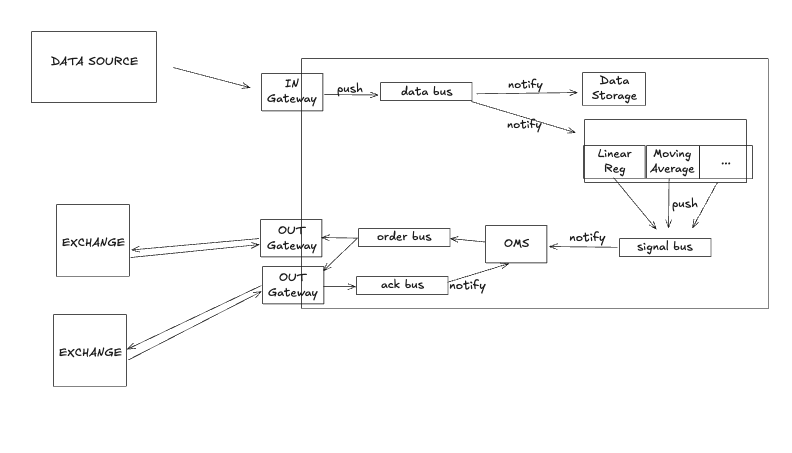

# CitClo
A dumb down trading system inspired by the book "Developing High-Frequency Trading Systems"
---

## 🏙 System Overview




---

## 🧱 Components

### 1. **Data Source**
Provides live market data (price, volume, etc.) to the system.

### 2. **InGateway**
Acts as an entry point for the incoming market data. It:
- Receives raw market data
- Pushes data onto the `data bus`

### 3. **DataBus**
A message bus responsible for transporting market data to:
- `Data Storage` for archiving
- `Signal Processors` for analysis

### 4. **DataStorage**
Archives all historical market data for backtesting and analytics.

### 5. **SignalGenerator**
These compute trading signals based on various algorithms like:
- **Linear Regression**
- **Moving Average**
- Others (e.g., momentum, RSI)

Processed signals are pushed onto the `signal bus`.

### 6. **Signal Bus**
Carries trading signals to the Order Management System (OMS).

### 7. **OMS (Order Management System)**
Central brain that:
- Makes trade decisions
- Pushes orders onto the `order bus`
- Tracks acknowledgements from the venues/exchanges.

### 8. **Order Bus**
Transports trading orders to `OUT Gateways`.

### 9. **ACK Bus**
Handles acknowledgements from exchanges and notifies OMS for order state updates.

### 10. **OutGateways**
Responsible for sending orders to multiple `EXCHANGES` and receiving acknowledgements.

### 11. **Exchanges**
External markets where trades are executed.

---

## 🔄 Data Flow Summary

1. **Market Data Ingestion:**  
   `DATA SOURCE → IN Gateway → data bus`

2. **Processing and Storage:**  
   `data bus → Data Storage & Signal Processors → signal bus`

3. **Order Flow:**  
   `signal bus → OMS → order bus → OUT Gateway → EXCHANGE`

4. **Acknowledgement Handling:**  
   `EXCHANGE → OUT Gateway → ack bus → OMS`

---

## Debug 

```bash
mkdir build
cd build
cmake -DCMAKE_BUILD_TYPE=Debug ..
make -j
```
